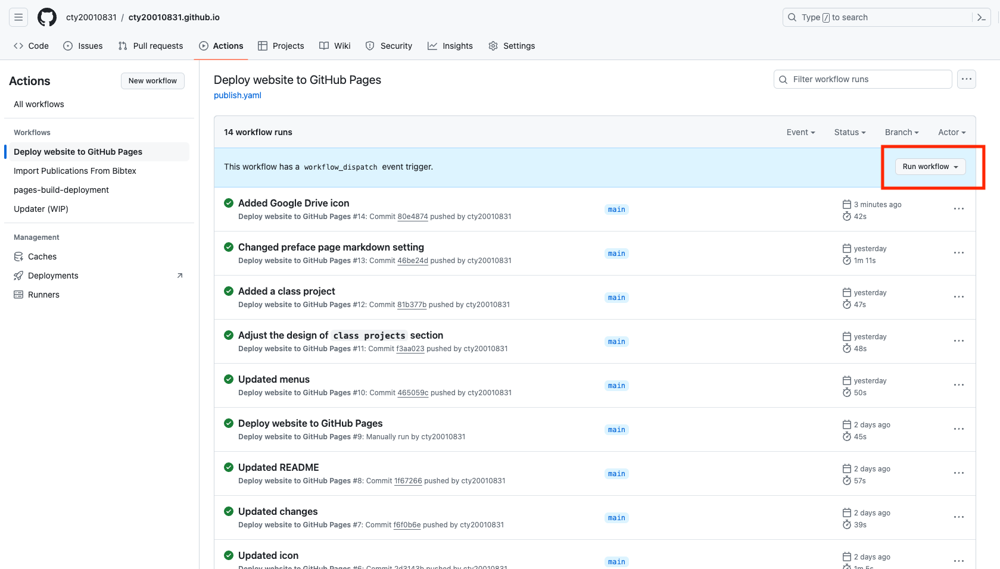

# [Personal Webpage](https://cty20010831.github.io)
This repository is used to create my personal academic website using [Hugo Academic CV Theme](https://github.com/HugoBlox/theme-academic-cv).

## Update Github Website
After pushing changes to this github repo, go to `Actions` section and `Deploy website to GitHub Pages` subsection and then click `Run workflow` to update changes to the personal website. See below:

## Resources Consulted
- [Official hugo documentation](https://docs.hugoblox.com/)
- [Finding emoji](https://emojifinder.com/)
- [Simple YAML tutoiral](https://learnxinyminutes.com/docs/yaml/)
